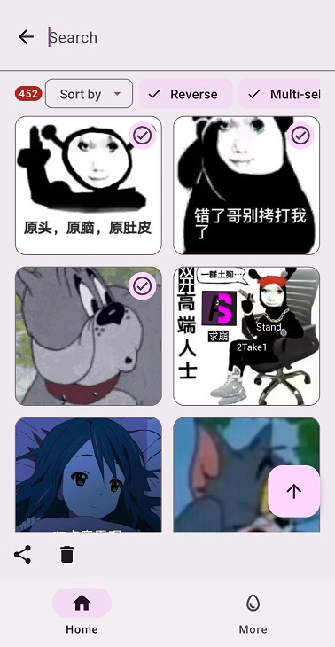
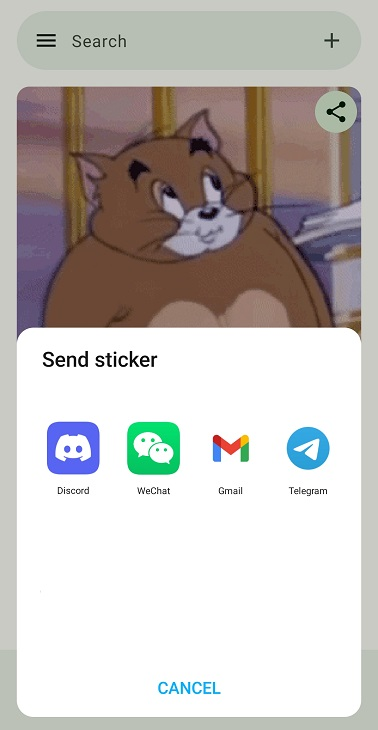
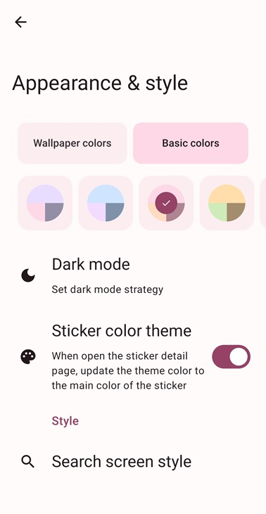
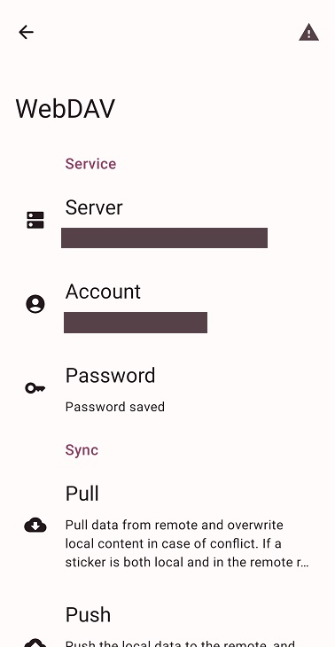
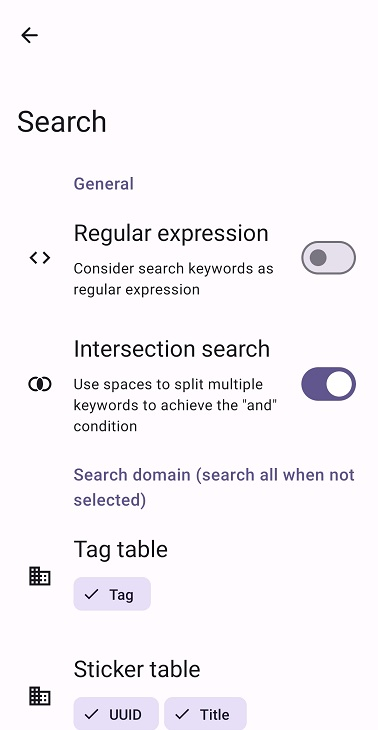
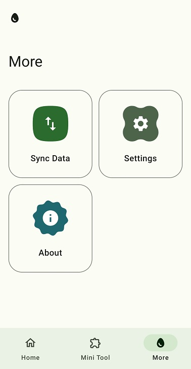
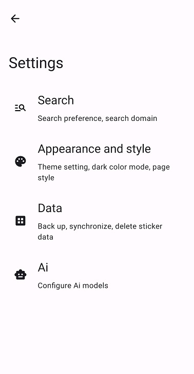
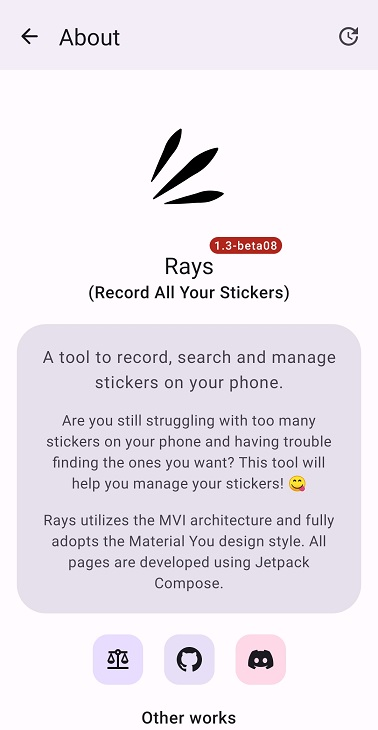

    

        
    

    <h1>🥰 Rays (Android)</h1>
    

        
        
        
        
        
    

    

        <b>Rays (Record All Your Stickers)</b>, A tool to <b>record, search and manage stickers</b> on your phone.
    

    

        🥰 Are you still struggling with <b>too many stickers on your phone</b> and having trouble finding the ones you want? This tool will help you <b>manage your stickers</b>! 😋
    

    

        Rays utilizes the <b><a href="https://developer.android.com/topic/architecture#recommended-app-arch">MVI</a></b> architecture and fully adopts the <b><a href="https://m3.material.io/">Material You</a></b> design style. All pages are developed using <b> <a href="https://developer.android.com/jetpack/compose">Jetpack Compose</a></b>.
    

    

        <b><a href="../../README.md">中文</a></b>&nbsp&nbsp&nbsp&nbsp&nbsp&nbsp
        <b><a href="https://github.com/SkyD666/Rays-Android/issues/4">Help us translate</a></b>
    

## 💡 Features

1. Support **tagging** for stickers
2. Support setting **search domains** (set the **fields of the database tables** to be searched)
3. Support searching using **regular expressions**
4. Support **recognizing text** in stickers
5. Support **recommending sticker tags** using **Ai** (support change models)
6. Support **syncing data using WebDAV**
7. Support importing a sticker through the **system "Share" page**
8. Support **changing and customizing theme colors**
9. Support **dark color mode**
10. ......

## 🤩 Screenshots

 
 
 
 
 

## 🔍 Search examples

<table>
<thead>
  <tr>
    <th>Intent</th>
    <th>Text input in the search bar when using regular expression</th>
    <th>Text input in the search bar when regular expression is not used</th>
  </tr>
</thead>
<tbody>
  <tr>
    <td>Search for content with the keyword "Genshin"</td>
    <td>.*Genshin.*</td>
    <td>Genshin</td>
  </tr>
  <tr>
    <td>Search only for the word "Genshin"</td>
    <td>Genshin or ^Genshin$</td>
    <td>⚠️Impossible</td>
  </tr>
  <tr>
    <td>Search for content with the keywords "crazy" or "Genshin"</td>
    <td>.*crazy.*|.*Genshin.*</td>
    <td>⚠️Impossible</td>
  </tr>
  <tr>
    <td>Search only for the word "crazy" or only for the word "Genshin"</td>
    <td>crazy|Genshin or ^crazy$|^Genshin$</td>
    <td>⚠️Impossible</td>
  </tr>
  <tr>
    <td>Search for content with the keywords "crazy" and "Genshin"</td>
    <td>.*crazy.*   .*Genshin.*</td>
    <td>crazy   Genshin</td>
  </tr>
  <tr>
    <td>Search for content with the keywords ("crazy" and with "Genshin") or "ikun"</td>
    <td>.*crazy.*|.*ikun.*   .*Genshin.*|.*ikun.*</td>
    <td>⚠️Impossible</td>
  </tr>
</tbody>
</table>
Note: **and** logic is represented by **space, tab, line break**, multiple of the above characters together are considered as one, extra spaces before and after the input box text will be ignored. The **"content "** in the form refers to the selected search domain (the results of multiple search domains are combined).

## 🛠 Primary technology stack

- Jetpack **Compose**
- **MVI** Architecture
- **Material You**
- **ViewModel**
- **Hilt**
- **ML Kit** (Machine Learning)
- **DataStore**
- Room
- Splash Screen
- Navigation
- Profile Installer

## ✨ Other works

<table>
<thead>
  <tr>
    <th>Work</th>
    <th>Description</th>
    <th>Link</th>
  </tr>
</thead>
<tbody>
  <tr>
    <td></td>
    <td><b>Raca (Record All Classic Articles)</b>, a tool to <b>record and search abstract passages and mini-essays</b> in the comments section locally. 🤗 Are you still having trouble remembering the content of your mini-essay and facing the embarrassing situation of forgetting the front, middle and back? Using this tool will help you <b>record the mini-essays</b> you come across and never worry about forgetting them again! 😋</td>
    <td><a href="https://github.com/SkyD666/Raca-Android">https://github.com/SkyD666/Raca-Android</a></td>
  </tr>
  <tr>
    <td></td>
    <td><b>NightScreen</b>, when you <b>use your phone at night</b> 🌙, Night Screen can help you <b>reduce the brightness</b> of the screen and <b>reduce the damage to your eyes</b>.</td>
    <td><a href="https://github.com/SkyD666/NightScreen">https://github.com/SkyD666/NightScreen</a></td>
  </tr>
</tbody>
</table>

## 📃 License

This software code is available under the following **license**

[**GNU General Public License v3.0**](LICENSE)
