

    

        
    

    <h1>🥰 Rays (Android)</h1>
    

        
        
        
        
        
        
    

    

        <b>Rays (Record All Your Stickers)</b>，一个在本地<b>记录、查找、管理表情包</b>的工具。
    

    

        🥰 您还在为手机中的<b>表情包太多</b>，找不到想要的表情包而苦恼吗？使用这款工具将帮助您<b>管理您存储的表情包</b>，再也不因为找不到表情包而烦恼！😋
    

    

        使用<b> <a href="https://developer.android.com/topic/architecture#recommended-app-arch">MVI</a> </b>架构，完全采用<b> <a href="https://m3.material.io/">Material You</a> </b>设计风格。<b>所有页面均使用 <a href="https://developer.android.com/jetpack/compose">Jetpack Compose</a> </b>开发。
    

    

        <b><a href="../../README.md">English</a></b>&nbsp&nbsp&nbsp&nbsp&nbsp&nbsp
        <b><a href="https://hosted.weblate.org/engage/rays/">帮助我们翻译</a></b>
    

## 💡主要功能

1. 支持为表情包打**标签**
2. 支持设置**搜索域**（设置搜索**数据库表的字段**）
3. 支持使用**正则表达式搜索**
4. 支持**识别**表情包中的**文本**
5. 支持 **Ai 推荐表情包标签**（支持更换模型）
6. 支持**使用 WebDAV 和文件同步**数据
7. 支持 **Ai 转移**图片的**风格**
8. 支持通过**系统“分享”页面导入**表情包
9. 支持**莫奈取色和自定义主题色**，支持主题色**跟随表情包主色调**变化
10. 支持**深色模式**
11. ......

## 🤩应用截图

 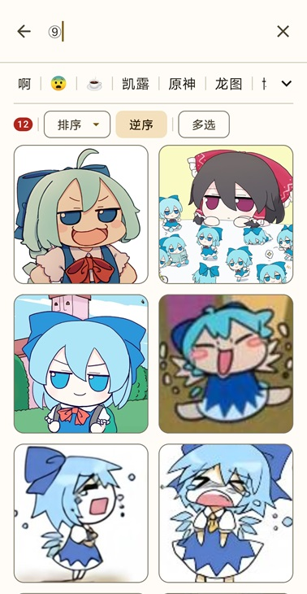
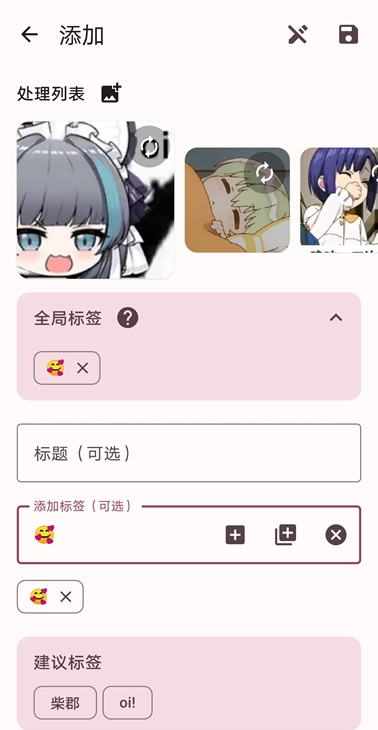 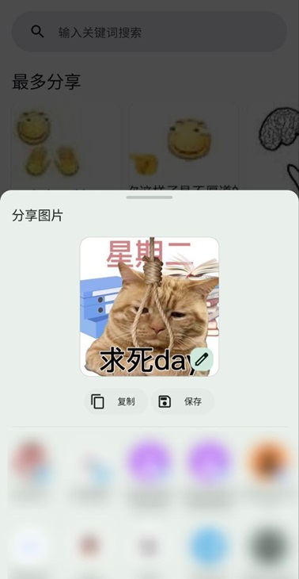
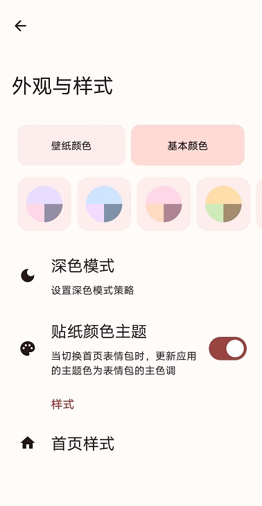 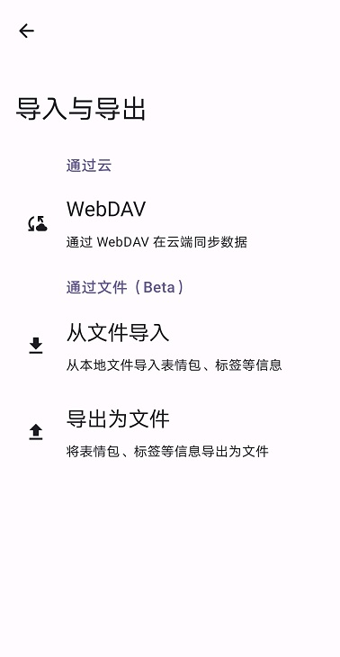
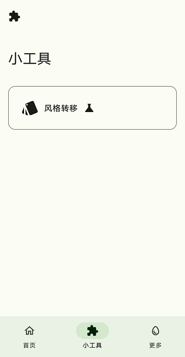 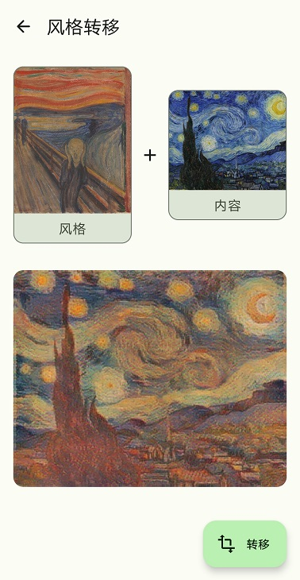
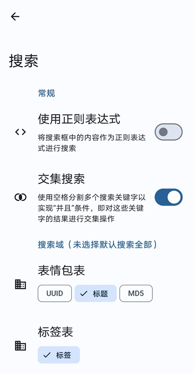 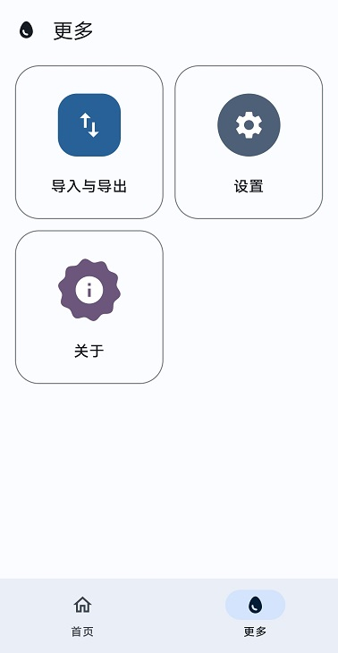
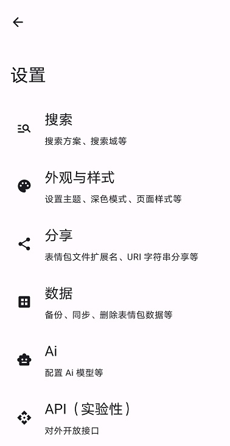 
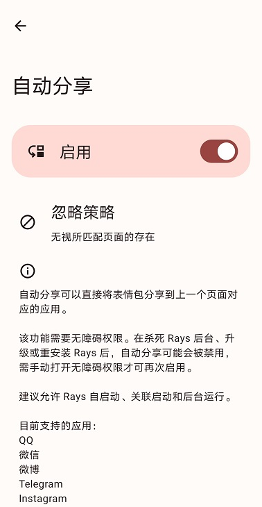 

## 🔍搜索示例

<table>
<thead>
  <tr>
    <th>意图</th>
    <th>使用正则表达式时搜索栏输入的文字</th>
    <th>不使用正则表达式时搜索栏输入的文字</th>
  </tr>
</thead>
<tbody>
  <tr>
    <td>搜索带有“原神”关键词的内容</td>
    <td>.*原神.*</td>
    <td>原神</td>
  </tr>
  <tr>
    <td>搜索仅为“原神”两个字的内容</td>
    <td>原神 或者 ^原神$</td>
    <td>⚠️无法实现</td>
  </tr>
  <tr>
    <td>搜索带有“发电” 或 带有“原神”关键词的内容</td>
    <td>.*发电.*|.*原神.*</td>
    <td>⚠️无法实现</td>
  </tr>
  <tr>
    <td>搜索仅为“发电”两个字 或 仅为“原神”两个字的内容</td>
    <td>发电|原神 或者 ^发电$|^原神$</td>
    <td>⚠️无法实现</td>
  </tr>
  <tr>
    <td>搜索带有“发电” 且 带有“原神”关键词的内容</td>
    <td>.*发电.*   .*原神.*</td>
    <td>发电   原神</td>
  </tr>
  <tr>
    <td>搜索带有（“发电” 且 带有“原神”） 或 带有“ikun”关键词的内容</td>
    <td>.*发电.*|.*ikun.*   .*原神.*|.*ikun.*</td>
    <td>⚠️无法实现</td>
  </tr>
</tbody>
</table>

注：<b>且</b> 逻辑使用 <b>空格、制表符、换行符</b> 表示，多个上述字符连接在一起时视为一个，输入框文字前后多余空格将被忽略。表格中的 <b>“内容”</b> 指的是选择的搜索域（多个搜索域的结果取并集）。

## 🌏翻译

如果您对此项目有兴趣，请帮助我们进行**翻译工作**，谢谢。

## 🛠主要技术栈

- Jetpack **Compose**
- **MVI** Architecture
- Kotlin **Coroutines and Flow**
- **Material You**
- **ViewModel**
- **Hilt**
- **DataStore**
- **TensorFlow** Lite
- **ML Kit** (Machine Learning)
- **Room**
- Splash Screen
- Navigation
- Coil
- Lottie
- Profile Installer

## 🤖机器学习

- 表情包分类：https://github.com/SkyD666/StickerClassification

## ✨其他应用

<table>
<thead>
  <tr>
    <th>工具</th>
    <th>描述</th>
    <th>传送门</th>
  </tr>
</thead>
<tbody>
  <tr>
    <td></td>
    <td><b>Raca (Record All Classic Articles)</b>，一个在本地<b>记录、查找抽象段落/评论区小作文</b>的工具。 🤗 您还在为记不住小作文内容，面临<b>前面、中间、后面都忘了</b>的尴尬处境吗？使用这款工具将<b>帮助您记录您所遇到的小作文</b>，再也不因为忘记而烦恼！😋</td>
    <td><a href="https://github.com/SkyD666/Raca-Android">https://github.com/SkyD666/Raca-Android</a></td>
  </tr>
  <tr>
    <td></td>
    <td><b>NightScreen</b>，当您在<b>夜间🌙</b>使用手机时，NightScreen 可以帮助您<b>减少屏幕亮度</b>，减少对眼睛的伤害。</td>
    <td><a href="https://github.com/SkyD666/NightScreen">https://github.com/SkyD666/NightScreen</a></td>
  </tr>
</tbody>
</table>

## 📃许可证

使用此软件代码需**遵循以下许可证协议**

[**GNU General Public License v3.0**](../../LICENSE)
